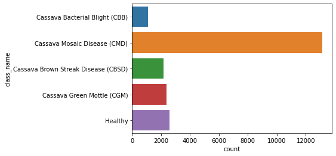

# Introduction
Cassava Leaf Disease Classification is a multiclass classification competition held at Kaggle (https://www.kaggle.com/c/cassava-leaf-disease-classification). As the second-largest provider of carbohydrates in Africa, cassava is a key food security crop grown by smallholder farmers. However, viral diseases are major sources of poor yields, and to diagonise diseases, farmers require the help of agricultural expers to visually insepct the plants, which is labor-intensive and time-consuming. The objective of this competition is to identify the common diseases with the help of data science and machine learning. 

In this competition, the train dataset includes 21,367 labelled images of Cassava leaves with four categories of diseases or healthy Cassava leaves. The task is to classify each image into one of the five categories mentioned above. 

# Summary

## Exploratory Data Analysis
The dataset was unbalanced with 61.9% of training images labelled with CMD (Cassava Mosaic Disease), a type of Cassava leaf disease. Dataset augmentation was done by by downsampling the majority class samples and upsampling the minority classes samples through various image scaling and color shifting. The dataset was split into 5 folds using StratifiedKFold. The random weighted sampler was also applied during the training process to increase the number of minority samples being trained. I trained four models (one resnext50, and three tf_efficientnet models with different seeds and one with CUTMIX applied during training) with individual cv scores as 0.894, 0.898, 0.895, 0.893. 

## Model
| Model           | CV          |
| ---             | ---         |
| EfficientNet-1   | 0.898     |
| EfficientNet-2   | 0.893     |
| EfficientNet-3 (CUTMIX applied)    | 0.895    |
| ResNext50     | 0.894 |

The ensemble of the above models achieve 90.11% accuray on the public data and 90.01% accuracy on the private data.

## Inference & Result
The training image augmentation was very heavy, including various types of flips, rotations, scale shifting, change of brightness and color saturations, and random coarse dropouts. 

Heavy image transformation was applied because the training images were collected from different places and different time during a day, which included many irrelevant factors that did not help with the classification task. Using heavy image augmentation can make the model more robust to such noise. The validation augmentation included just center crop and normalization. At the inference stage, Test-Time Augmentation was also applied to make the classification more robust.  

# Project Structure
The project has the following structure:
- `codes/`: `.py` scripts with training, inference and data processing functions
- `notebooks/`: `.ipynb` notebooks for exploratory data analysis, model training and inference
- `data/`: input csv and json data 
- `images/`: the training images (acutal images are not included due to size constraints and can be downloaded from Kaggle: 
    -  [Competition dataset](https://www.kaggle.com/c/cassava-leaf-disease-classification)
    -  [External merged dataset](https://www.kaggle.com/tahsin/cassava-leaf-disease-merged)
- `output/`: model configurations, weights and diagrams exported from notebooks
- `pretrained-models/`: model configurations and weights pretrained on external datasets

# Result
The final ensembled model with 8x TTA scored 90.11% accuracy in the public leaderboard and 90.01% in the private leaderboard, ranked 84 out of 3947 competitors (top 3%) (https://www.kaggle.com/c/cassava-leaf-disease-classification/leaderboard).
